# **All You Need To Know About Glasp - A Social Web Highlighter**
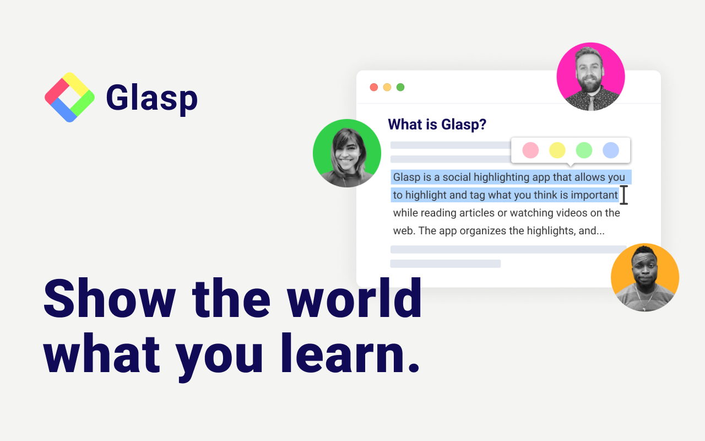

## **Table Of Content**
[Introduction](#introduction)  
[What Is Glasp?](#what-is-glasp) 
[Why Use Glasp?](#why-use-glasp) 
[How Does Glasp Work?](#how-does-glasp-work) 
> [Hightlights And Notes](#highlights-and-notes) 
> [Managing Reading List](#managing-reading-list) 
[Reading From Others](#reading-from-others) 
[Features Of Glasp](#features-of-glasp) 
[Youtube Highlight](#youtube-highlight) 
[Kindle Integration](#kindle-integration) 
[Quoteshot](#quoteshot) 
[Knowledge Graph](#knowledge-graph)  
[AI Summary](#ai-summary) 
[PDF Highlight](#pdf-highlight) 
[Embed In Blog](#embed-in-blog) 
[Download All](#download-all)   
[Benefits Of Using Glasp](#benefits-of-using-glasp) 
[Content Curation](#content-curation) 
[Knowledge Management](#knowledge-management) 
[Community And Accountability](#community-and-accountability) 
[Conclusion](#conclusion)   

## **Introduction**
If you love to take notes while reading online, you’d agree with me that switching between the article you’re reading and a note-taking app can be daunting! But what if you could have all these notes in one place and then easily copy them to your note app at the end of your reading? Glasp helps you do just that!

 

## **What Is Glasp?**
Glasp is a social web highlighting tool that allows you to highlight and take note of anything you read on the web. It is social because it allows others on the platform to see and learn about what you read and interact with your highlights.

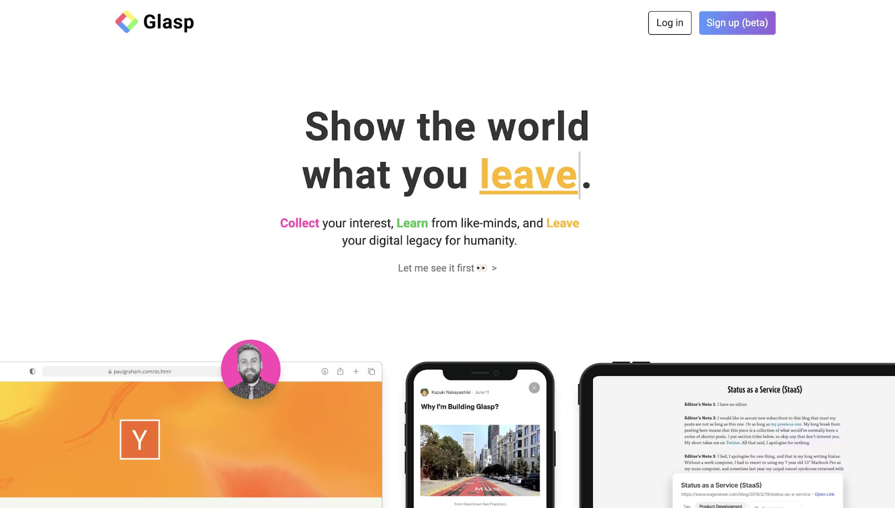

 

## **Why Use Glasp?**
Unlike other highlighting tools, Glasp lets you keep track of insights from articles or videos you watch on the web and then copy or download them without switching between tabs.

While highlighting, you can add your notes and tags to categorise your content. Everyone following you can see what you’re reading and topics you’re interested in. You’d also see the highlights of people you follow, which you can comment on, save or share. Helping you build a network of like-minded people.

Glasp also allows you to see statistics of your web highlights, as well as that of others, helping you stay accountable for your learnings.  

Also, you can download your web highlights in formats like CSV, HTML, Markup Language or text, which can easily integrate with any program.

 

## **How Does Glasp Work?**
Glasp is only available as a Google Chrome or Safari extension and can only be used on the web. You can use Glasp by adding the extension to your Chrome (or Safari) browser. After adding, you will see the Glasp Icon on your extension bar.

**Let’s take a look at its key elements:**

 

### **Highlight And Notes**
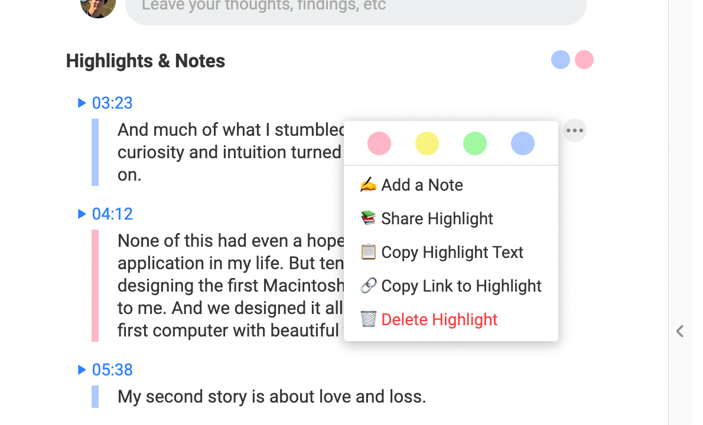

While reading an article online, and you find something that resonates with you, you can easily highlight it by selecting the words or phrases you want to take note of, and the Glasp tool kit will appear on top of the text. You can select any Color you wish to highlight it with, add your note to it, or share it as a post on Twitter.

Once you highlight a phrase or add a note, it automatically appears on the right side of your page, with its link and author name. You can also manually add the author and tags to categorise your highlights.

 

### **Managing Reading List**

On the navigation, you can find highlights from Articles you have read or videos you have watched, as well as topics from the same author.

You can also save highlights you find interesting to your saved list or add your favourite highlights to your favourite list, where you can quickly get back to them.

 

### **Reading From Others**
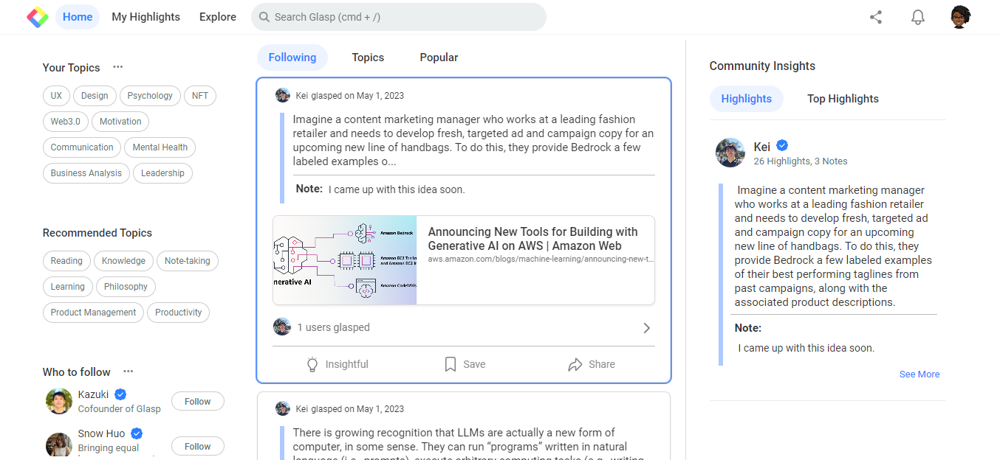

Glasp's social media feature allows you to search and follow people who share the same interests as you.

Based on your topic of interest, Glasp recommends users who share highlights on those topics. You can follow them to see topics they read about, or search for topics and authors you would love to follow

Posts from these people or topics you follow, will appear on your timeline, and you can easily save or interact with them.

You can also click on their profile to see the number of highlights they have made, pages they have visited and topics they are interested in.

You can also ask them questions about their topics of interest or view their knowledge of those topics using the knowledge graph feature.

 

## **Features Of Glasp**
The major features of Glasp are its Note-taking and Social feature. Other amazing features of Glasp include:

### **Youtube Highlight**
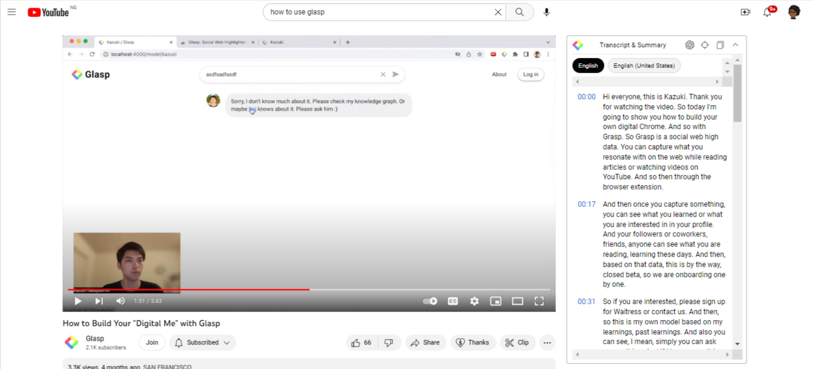

While watching a youtube video, you can copy your highlight and transcribe it into your note-taking app just in one click.

### **Kindle Integration**
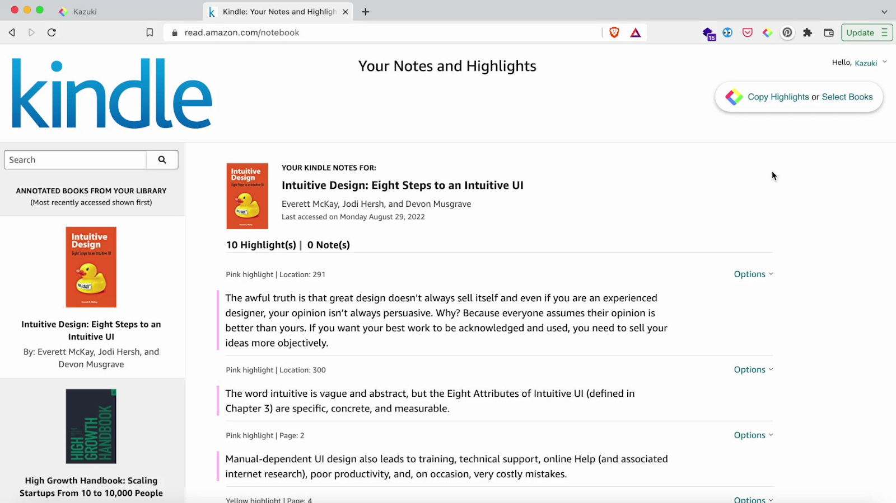

This feature allows you to synchronize highlights from your readings on Kindle, into your Glasp profile. You can also download them in any file format you want.

### **Quoteshot**
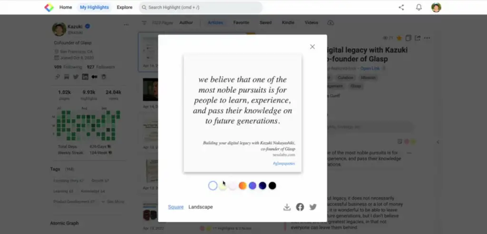

This feature gives you a beautiful graphic of your highlight which you can share on social media. You can choose any color for the graphics, change the text style, and download or share on social media platforms.

### **Knowledge Graph**
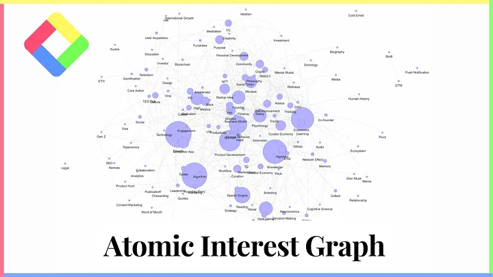

Knowledge Graph people to see how much knowledge you have accumulated around a certain topic. You can view an entire knowledge Graph, or select a specific topic to see your knowledge graph in that area.

### **AI Summary**
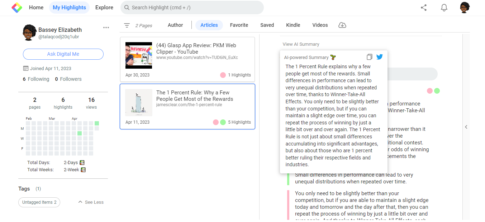

Based on your accumulated highlights, this feature gives you an AI-powered summary of all your highlights, which you can copy to a post, or share on Twitter.

### **PDF Highlight**
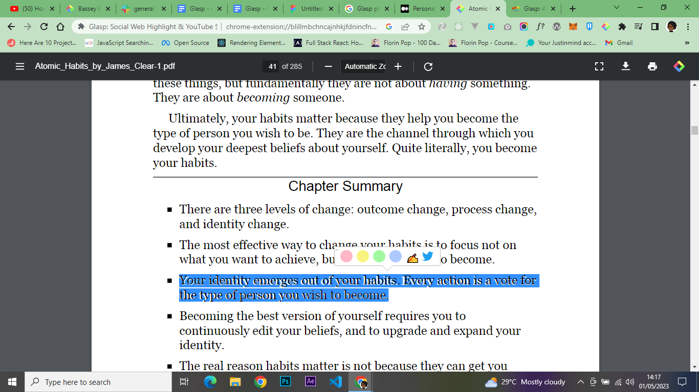

This feature allows you to highlight and take notes on PDF files hosted on the web. However, due to technical and security reasons, Glasp does not allow highlights on certain websites, including Google products, note-taking apps, bank apps, and local PDF files.

### **Embed In Blog**
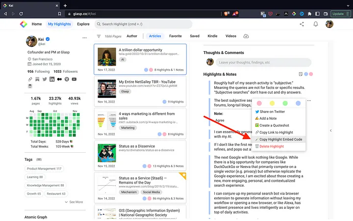

This feature allows you to embed your Glasp profile and Highlights in blogs such as Notion or Obsidian, using an embed code.

### **Download All**
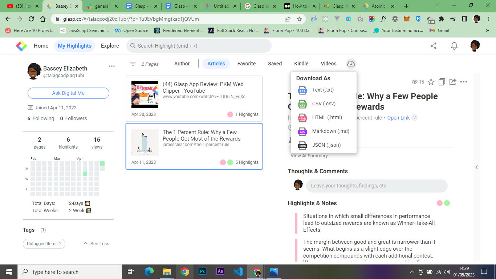

This feature allows you to download all your Notes and Highlights as either text, CSV, HTML, or Markup files. Making it easy for you to integrate them into any program.

 

## **Benefits Of Using Glasp**

### **Content Curation**
With Glasp, content curators can easily highlight and organize their notes all in one place, without interrupting their reading experience. They can also copy or download their curated Notes in any format that would be easy to integrate into their blog posts.
Knowledge management.

### **Knowledge Management**
Glasp allows you to organize your content with tags, search or filter by topics, so you can easily access Highlights, Notes or Ideas that you’re interested in.

### **Community And Accountability**
Glasp allows you to access what others are reading as well as share your Highlights and Notes with others, creating social accountability for readers.

 

## **Conclusion**

Glasp is an amazing tool that does not just allow you to take note of what you read but to do so in a more organized and seamless way. It takes away the stress of keeping track of your notes, allowing you to focus on the most important things. Also, it connects you with like-minded people and helps you stay accountable with your readings.

So get started with Glasp and enjoy seamless highlighting by [signing up on Glasp](https://glasp.co) today! 

